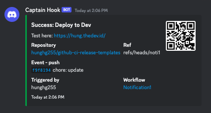
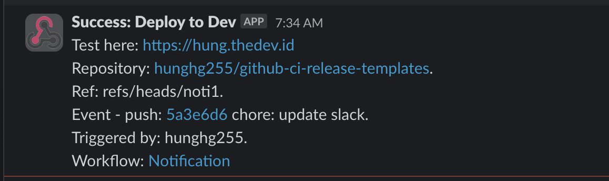
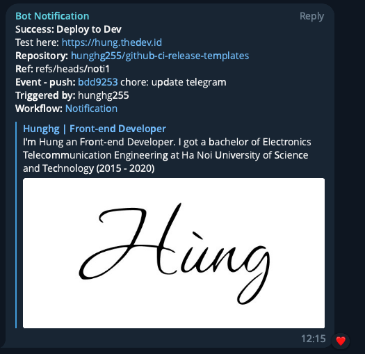
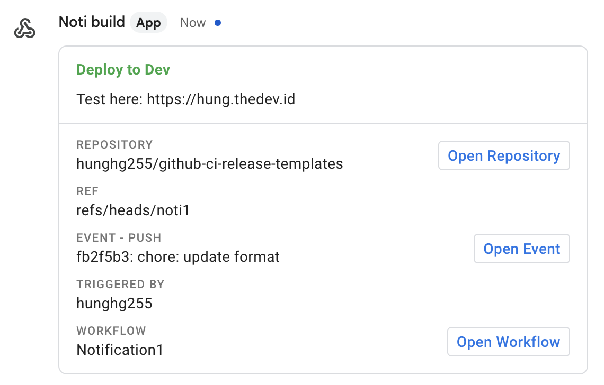
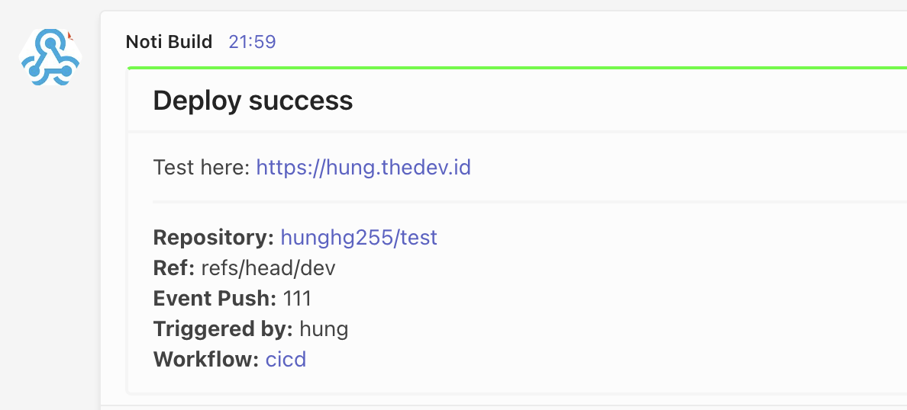

<p align="center">
<a href="https://www.npmjs.com/package/action-notifications" target="_blank" rel="noopener noreferrer">
</a>
</p>

<p align="center">
  A Github actions notification to Discord, Slack, Telegram, Google chat, Microsoft Teams, Support show QR code
</p>


<p align="center">
  <a href="https://github.com/hunghg255/action-notifications/graphs/contributors" target="_blank" rel="noopener noreferrer"></a>
  <a href="https://github.com/hunghg255/action-notifications/blob/main/LICENSE" target="_blank" rel="noopener noreferrer"></a>
</p>

## Usage

```yaml
uses: hunghg255/action-notifications@master
with:
  discord_webhook: ${{ secrets.DISCORD_WEBHOOK }}
  slack_webhook: ${{ secrets.SLACK_WEBHOOK }}
  telegram_bot_token: ${{ secrets.TELEGRAM_BOT_TOKEN }}
  telegram_chat_id: ${{ secrets.TELEGRAM_CHAT_ID }}
  # telegram_message_thread_id: ${{ secrets.TELEGRAM_MESSAGE_THREAD_ID }}
  google_chat_webhook: ${{ secrets.GOOGLE_CHAT_WEBHOOK }}
  ms_teams_webhook: ${{ secrets.MS_TEAMS_WEBHOOK }}
  title: "Deploy to Dev"
  description: "Test here: https://hung.thedev.id"
```

## What's in a notification

Every notification includes, with a status color and emoji (✅ Success / ❌ Failure / ⚠️ Cancelled):

- Repository (linked)
- Branch or tag (linked)
- Commit SHA (linked)
- Event detail (commit message, PR title, or release notes)
- Who triggered the run (with avatar on Discord)
- Workflow name and run number, linked to the run

## Runtime Compatibility

- Action runtime: `node24` (defined by GitHub Action metadata in `action.yml`).
- Development and CI: Node.js 24.

For local development:

```bash
nvm use 24
npm ci
npm run type-check
npm test
npm run build
```

## Local Discord Test Script

Use `scripts/test-discord-local.js` to validate Discord payload formatting and delivery without running a full GitHub Actions workflow.

Usage:

```bash
node scripts/test-discord-local.js <webhook_url> [title] [description]
```

Example:

```bash
node scripts/test-discord-local.js "https://discord.com/api/webhooks/..." "Node 24 Upgrade Test" "Testing Discord notification from local script"
```

What the script does:

- Builds a mock GitHub context (`push` event, repository, actor, workflow run link).
- Generates a Discord embed payload aligned with the action formatting logic.
- Sends the payload to the provided webhook URL using `axios`.
- Exits with code `0` on success and `1` on failure.

Security note:

- Treat webhook URLs as secrets.
- If a webhook URL is ever shared publicly, rotate it immediately in Discord.

## Inputs
| Properties                   | Description                       |                              |
| ---------------------------- | --------------------------------- | :--------------------------- |
| discord\_webhook             | Discord Webhook                   |                              |
| slack\_webhook               | Slack Webhook                     |                              |
| slack\_username              | Slack Username                    |                              |
| telegram\_bot\_token         | Telegram Bot Token                | Require `telegram_chat_id`   |
| telegram\_chat\_id           | Telegram Chat ID                  | Require `telegram_bot_token` |
| telegram\_message\_thread_id | Telegram Thread Message For Topic |                              |
| google\_chat\_webhook        | Google Chat Webhook               |                              |
| ms\_teams\_webhook           | Microsoft Teams Webhook           |                              |
| title                        | Title                             |                              |
| description                  | Description                       |                              |
| qrcode                       | Text                              |                              |

- Config telegram bot, get chat id: [CONFIG_TELEGRAM_BOT](https://github.com/hunghg255/action-notifications/blob/master/CONFIG_TELEGRAM_BOT.md)

## Example
```yaml
name: Notification

on:
  push:
    branches:
      - nofication

jobs:
  deploy:
    runs-on: ubuntu-latest
    steps:
      - name: Checkout
        uses: actions/checkout@v3

      - name: Build and lint
        run: |
          echo "Build and lint"

      - name: Notification Failure
        if: failure()
        uses: hunghg255/action-notifications@master
        with:
          discord_webhook: ${{ secrets.DISCORD_WEBHOOK }}
          slack_webhook: ${{ secrets.SLACK_WEBHOOK }}
          telegram_bot_token: ${{ secrets.TELEGRAM_BOT_TOKEN }}
          telegram_chat_id: ${{ secrets.TELEGRAM_CHAT_ID }}
          # Remove comment below for Telegram Topic Message
          # telegram_message_thread_id: ${{ secrets.TELEGRAM_MESSAGE_THREAD_ID }}
          google_chat_webhook: ${{ secrets.GOOGLE_CHAT_WEBHOOK }}
          ms_teams_webhook: ${{ secrets.MS_TEAMS_WEBHOOK }}
          title: "Deploy to Dev"
          description: "Test here: https://hung.thedev.id"

  notifification:
    needs: deploy
    runs-on: ubuntu-latest

    steps:
      - name: Notification Success
        uses: hunghg255/action-notifications@master
        if: always()
        with:
          discord_webhook: ${{ secrets.DISCORD_WEBHOOK }}
          slack_webhook: ${{ secrets.SLACK_WEBHOOK }}
          telegram_bot_token: ${{ secrets.TELEGRAM_BOT_TOKEN }}
          telegram_chat_id: ${{ secrets.TELEGRAM_CHAT_ID }}
          # Remove comment below for Telegram Topic Message
          # telegram_message_thread_id: ${{ secrets.TELEGRAM_MESSAGE_THREAD_ID }}
          google_chat_webhook: ${{ secrets.GOOGLE_CHAT_WEBHOOK }}
          ms_teams_webhook: ${{ secrets.MS_TEAMS_WEBHOOK }}
          title: "Deploy to Dev"
          description: "Test here: https://hung.thedev.id"
```


## Results

- Discord




- Slack




- Telegram



- Google Chat



- Microsoft Teams


