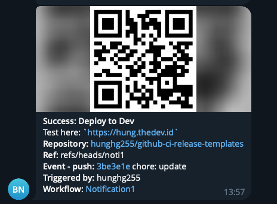

# Github actions notification to Discord, Slack, Telegram, Google chat, Microsoft Teams

---

Fork from [actions-status-discord](https://github.com/sarisia/actions-status-discord)

## Usage

```yaml
uses: hunghg255/action-notifications@master
with:
  discord_webhook: ${{ secrets.DISCORD_WEBHOOK }}
  slack_webhook: ${{ secrets.SLACK_WEBHOOK }}
  telegram_bot_token: ${{ secrets.TELEGRAM_BOT_TOKEN }}
  telegram_chat_id: ${{ secrets.TELEGRAM_CHAT_ID }}
  google_chat_webhook: ${{ secrets.GOOGLE_CHAT_WEBHOOK }}
  ms_teams_webhook: ${{ secrets.MS_TEAMS_WEBHOOK }}
  title: "Deploy to Dev"
  description: "Test here: https://hung.thedev.id"
```

## Inputs
| Properties                   | Description                       |                              |
| ---------------------------- | --------------------------------- | :--------------------------- |
| discord\_webhook             | Discord Webhook                   |                              |
| slack\_webhook               | Slack Webhook                     |                              |
| slack\_username              | Slack Username                    |                              |
| telegram\_bot\_token         | Telegram Bot Token                | Require `telegram_chat_id`   |
| telegram\_chat\_id           | Telegram Chat ID                  | Require `telegram_bot_token` |
| telegram\_message\_thread_id | Telegram Thread Message For Topic |                              |
| google\_chat\_webhook        | Google Chat Webhook               |                              |
| ms\_teams\_webhook           | Microsoft Teams Webhook           |                              |
| title                        | Title                             |                              |
| description                  | Description                       |                              |
| qrcode                       | Text                              |                              |

- Config telegram bot, get chat id: [CONFIG_TELEGRAM_BOT](https://github.com/hunghg255/action-notifications/blob/master/CONFIG_TELEGRAM_BOT.md)

## Example
```yaml
name: Notification

on:
  push:
    branches:
      - nofication

jobs:
  deploy:
    runs-on: ubuntu-latest
    steps:
      - name: Checkout
        uses: actions/checkout@v3

      - name: Build and lint
        run: |
          echo "Build and lint"

      - name: Notification Failure
        if: failure()
        uses: hunghg255/action-notifications@master
        with:
          discord_webhook: ${{ secrets.DISCORD_WEBHOOK }}
          slack_webhook: ${{ secrets.SLACK_WEBHOOK }}
          telegram_bot_token: ${{ secrets.TELEGRAM_BOT_TOKEN }}
          telegram_chat_id: ${{ secrets.TELEGRAM_CHAT_ID }}
          google_chat_webhook: ${{ secrets.GOOGLE_CHAT_WEBHOOK }}
          ms_teams_webhook: ${{ secrets.MS_TEAMS_WEBHOOK }}
          title: "Deploy to Dev"
          description: "Test here: https://hung.thedev.id"

  notifification:
    needs: deploy
    runs-on: ubuntu-latest

    steps:
      - name: Notification Success
        uses: hunghg255/action-notifications@master
        if: always()
        with:
          discord_webhook: ${{ secrets.DISCORD_WEBHOOK }}
          slack_webhook: ${{ secrets.SLACK_WEBHOOK }}
          telegram_bot_token: ${{ secrets.TELEGRAM_BOT_TOKEN }}
          telegram_chat_id: ${{ secrets.TELEGRAM_CHAT_ID }}
          telegra_message_thread_id: $ {{ secrets.TELEGRAM_MESSAGE_THREAD_ID }}
          google_chat_webhook: ${{ secrets.GOOGLE_CHAT_WEBHOOK }}
          ms_teams_webhook: ${{ secrets.MS_TEAMS_WEBHOOK }}
          title: "Deploy to Dev"
          description: "Test here: https://hung.thedev.id"
```


## Results

- Discord


- Slack


- Telegram



- Google Chat


- Microsoft Teams


