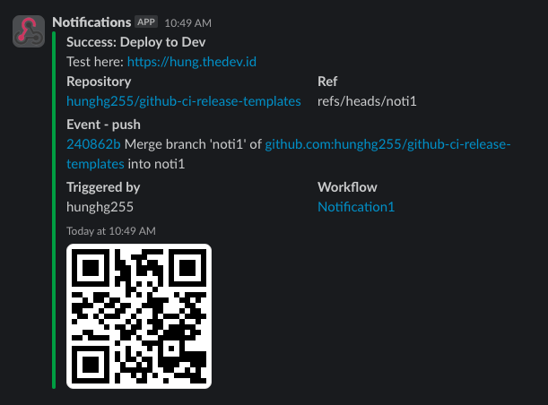

# Github actions notification for Discord and Slack


## Usage

```yaml
uses: hunghg255/action-notifications@master
with:
  discord_webhook: ${{ secrets.DISCORD_WEBHOOK }}
  slack_webhook: ${{ secrets.SLACK_WEBHOOK }}
  telegram_bot_token: ${{ secrets.TELEGRAM_BOT_TOKEN }}
  telegram_chat_id: ${{ secrets.TELEGRAM_CHAT_ID }}
  title: "Deploy to Dev"
  description: "Test here: https://hung.thedev.id"
```


## Inputs
| Properties           | Description        |                            |
| -------------------- | ------------------ | :------------------------- |
| discord\_webhook     | Discord Webhook    |                            |
| slack\_webhook       | Slack Webhook      |                            |
| telegram\_bot\_token | Telegram Bot Token | Require telegram\_chat\_id |
| telegram\_chat\_id   | Telegram Chat ID   | Require telegram\_chat\_id |
| title                | Title              |                            |
| description          | Description        |                            |


## Example
```yaml
name: Notification

on:
  push:
    branches:
      - nofication

jobs:
  deploy:
    runs-on: ubuntu-latest
    steps:
      - name: Checkout
        uses: actions/checkout@v3

      - name: Build and lint
        run: |
          echo "Build and lint"

      - name: Notification Failure
        if: failure()
        uses: hunghg255/action-notifications@master
        with:
          discord_webhook: ${{ secrets.DISCORD_WEBHOOK }}
          slack_webhook: ${{ secrets.SLACK_WEBHOOK }}
          telegram_bot_token: ${{ secrets.TELEGRAM_BOT_TOKEN }}
          telegram_chat_id: ${{ secrets.TELEGRAM_CHAT_ID }}
          title: "Deploy to Dev"
          description: "Test here: https://hung.thedev.id"

  notifification:
    needs: deploy
    runs-on: ubuntu-latest

    steps:
      - name: Notification Success
        uses: hunghg255/action-notifications@master
        if: always()
        with:
          discord_webhook: ${{ secrets.DISCORD_WEBHOOK }}
          slack_webhook: ${{ secrets.SLACK_WEBHOOK }}
          telegram_bot_token: ${{ secrets.TELEGRAM_BOT_TOKEN }}
          telegram_chat_id: ${{ secrets.TELEGRAM_CHAT_ID }}
          title: "Deploy to Dev"
          description: "Test here: https://hung.thedev.id"
```


## Results



